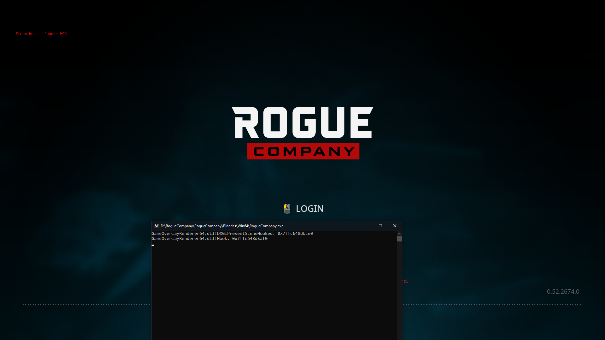

# Steam-Hook-Render-PoC

## Features
Ready to Inject

Pattern Scan

Steam Overlay PresentScene Hook (You can draw on top of games)

Imgui Ready

## Usage
Goto Properties -> VC++ Directories -> Include Directories and add imgui folder

Compile With Visual Studio

Use a DLL injector to inject the DLL

## Picture

